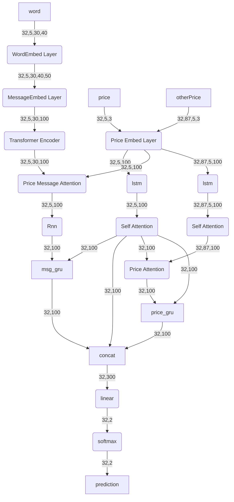

# Text Price Information Network

利用股票的过往价格（包括本股票的价格信息，以及同一股市其他股票的价格信息）以及有关该股票的历史文章对股票未来的价格趋势做出预测。

## Dependencies

- python 3.6
- pytorch 1.10.0

## Directories

- src: 源代码文件等
- res：
  - 词汇文件
    - stocknet所使用的词汇文件vocab.txt
    - 我们收集的文本数据的词汇文件am_vocab.txt
  - 预训练的[Glove](https://github.com/stanfordnlp/GloVe)词向量
- data:[stocknet data](https://github.com/yumoxu/stocknet-dataset)
- my_data:自己收集的data

## Configurations

我们通过修改 `config.yml` 中的各个参数来设置数据以及模型等， 例如：通过修改文件中的 `use_data`我们可以改变训练时所使用的数据，当设置其为stocknet时使用 [stocknet](https://github.com/yumoxu/stocknet-dataset)的数据。

## 数据格式

数据经过预处理后，共有以下几个部分：

- word:读取文章数据，并将其中的每一个单词转为数字索引。shape:(batch_size, max_n_days, max_n_msgs, max_n_words);
- price:本股票的价格信息，包含开盘日的最高、最低以及关市价格。shape:(batch_size, max_n_days, 3)
- other_price:其余股票同时期的价格信息。shape:(batch_size, stock_size-1, max_n_days, 3)

## 模型框架

以batch_size=32, max_n_days=5,max_n_msgs=30,max_n_words=40,stock_size=88举例(若图不清晰，可以复制代买至markdown中选择mermaid查看)

## Running

当配置完各种参数信息后，我们可以在src目录下用python Main.py命令开始模型的训练

## 作者

邮箱:luyuanhang137@qq.com
